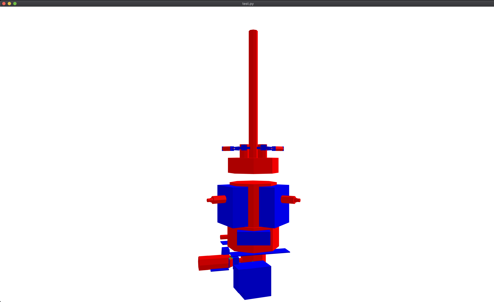

# Reversing Engineering using Deep Learning on CAD Models
Implementation of the project for IMPA course Design and Implementation of 3D Graphics Systems 2020


In this work, we propose to address the problem of reverse engineering on CAD models. The main goal is to use mesh segmentation using deep learning to extract common geometries on such models.


_This image is merely ilustrative_

## Methodology Overview

For a more detailed overview of this work please visit the page of this repository!

https://wallashss.github.io/cad_reverse_engineering_dl/

## Setup

First of all, we assume you current directory in the terminal is `src`.

There are 4 main modules:

- `dataset_generator.py` generate the dataset to train the model from the scratch
- `mesh2tfrecord.py` read a mesh (in a format supported by the trimesh library) and convert to tfrecord  
- `test.py` load a tfrecord and execute the model for the mesh segmentation
- `trainning.py` trains the model if the setup is ready.

There is also some folders that the code assume to exist to work. 

- `model/reverse_eng_model` this is where the weights of the trainning are stored. It is required to run `test.py` and `tranning.py` creates it if it does no exist.
- `dataset` contains some folders which `trainning.py` and `dataset_generator.py` read and write.

### Installation

Install project dependencies

```sh
pip install -r requirements.txt
```

>Note: Some people reported problems to install tensor_graphics because of the openexrpython dependency. If you (also) experience this, try to download the source (https://github.com/jamesbowman/openexrpython) and follow the instructions there to manually install it.

### Running a simple segmentation

Run a segmentation for an input tfrecord file.

```sh
python test.py <input.tfrecord>
```

The module will apply the segmentation and then show it in a window.



> Note: It will merge all examples of the files in a single mesh. 

### Convert a mesh to tfrecord

If you would like to convert a polygon mesh in a standard format (ply, obj, gltf, ... any format that trimesh supports) run:

```sh
python test.py <input_file>
```

It will split the geometry in parts and generate a tfrecord dataset. Therefore you can run `test.py`. 

### Dataset generation

For the dataset generator works, the `dataset` folder must have a structured directory:

```
dataset/
dataset/_datasets/
dataset/_labels/
dataset/_labels/boxes
dataset/_labels/cones
dataset/_labels/cylinders
dataset/_labels/torus

```

The `_datasets` is destination folder for the datasets to be generated. For instance, it creates tfrecord with format `tests_<NUM_TESTS>.tfrecord` and `train_<NUM_TRAIN>.tfrecord` . See `dataset_generator.py` to adjust the parameters `<NUM_TESTS>` and `NUM_TRAIN`, which are hardcoded.

The folders inside `_labels` contains indiviual files for each geometry sample. They can in be any standard format for meshes (again, supported by trimesh). To balance the dataset look functions `generate_dataset` and `draw_geometry` in `dataset_generator.py`. The count for each geometry type is hardcoded.

Then just run:

```sh
python dataset_generator.py
```

### Trainning

Finally, for the trainning, the module look for the datasets in the `_datasets` (see previous section). It will read tfrecord datasets with pattern `train_*.tfrecord` and `tests_*.tfrecord` for trainning and testing respectively.

> Note: The patterns implies that it can read more than one file for each type of dataset.

Start the trainning running:

```sh
python trainning.py
```